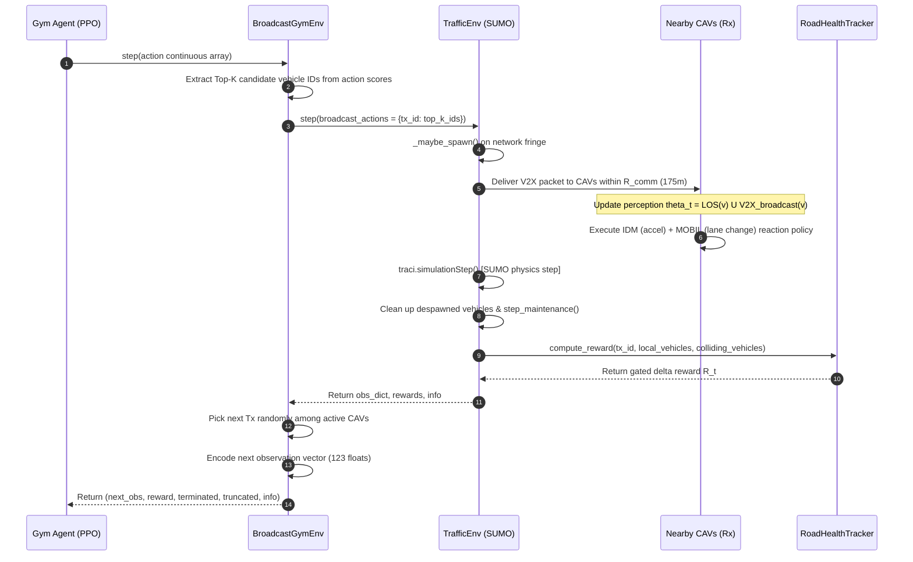

# RL Environment & Training Setup Summary (`BroadcastGymEnv`)

This document provides a complete reference for the Gymnasium environment (`BroadcastGymEnv`), SUMO integration (`TrafficEnv`), reward mechanism (`RoadHealthTracker`), observation/action spaces, step execution flow, and information flow.

---

## 1. High-Level Concept & Framing

- **Goal**: Train a Connected Autonomous Vehicle (CAV) policy to select which top-$K$ perceived objects to broadcast over V2X communication to maximize network-wide safety and traffic flow efficiency.
- **Agent Framing**: **Single-Agent Shell over Multi-Agent Traffic Sim** (PPO stepping stone prior to MAPPO).
  - At each step $t$, the environment randomly selects one active CAV as the Transmitter (**Tx**).
  - The policy receives Tx's local observation, scores candidates, and broadcasts $K=5$ objects.
  - All surrounding CAVs within communication range receive the broadcast packet, update their perception, and execute custom collision-avoidance / car-following policies.
  - The reward reflects the marginal improvement in local road health surrounding the Tx.

---

## 2. Environment Variables & Hyperparameters Fact Sheet

| Parameter | Value / Variable | Description |
|---|---|---|
| **Max Candidate Objects ($N_{\text{max}}$)** | `20` | Max candidate objects encoded in observation / action spaces |
| **Feature Dimension ($\text{FEAT\_DIM}$)** | `6` | Relative state vector per candidate object |
| **Ego State Dimension ($\text{OWN\_DIM}$)** | `3` | Transmitter's own vehicle dynamics |
| **Observation Space Shape** | `(123,)` | `Box(-inf, inf, shape=(20*6 + 3,))` |
| **Action Space Shape** | `(20,)` | `Box(-10.0, 10.0, shape=(20,))` (continuous scores) |
| **Broadcast Limit ($K$)** | `5` | Top-$K$ candidate objects transmitted per Tx step |
| **Sensing Range ($R_{\text{sense}}$)** | `50.0 m` | Direct Line-of-Sight (LOS) sensor detection range |
| **FOV Cone** | `180°` | Transmitter sensor field-of-view |
| **Comm Range ($R_{\text{comm}}$)** | `175.0 m` | V2X wireless transmission range |
| **CAV Penetration Rate** | `0.5` ($50\%$) | Fraction of spawned vehicles equipped as CAVs |
| **Vehicle Spawn Rate** | `0.4` | Probability of spawning a new vehicle on fringe edge per step |
| **Max Episode Steps** | `500` | Truncation limit for an episode |
| **Harsh Brake Threshold** | `-3.0 m/s²` | Acceleration threshold defining a harsh braking event |
| **Collision Penalty** | `50.0` | Penalty factor inside road health metric $H_t$ |
| **Warmup Steps** | `200` | Sim steps before freezing running normalization statistics |

---

## 3. Observation & Action Space Details

### Observation Vector Anatomy (123 floats)
The observation vector is a concatenated flattened array of candidate features followed by ego dynamics:

1. **Candidate Objects Feature Matrix** ($20 \times 6 = 120$ floats):
   - `rel_x`: Relative X position $(\text{obj}_x - \text{tx}_x)$ in meters
   - `rel_y`: Relative Y position $(\text{obj}_y - \text{tx}_y)$ in meters
   - `rel_vx`: Relative longitudinal velocity $(\text{obj}_v - \text{tx}_v)$ in m/s
   - `rel_vy`: `0.0` (placeholder for lateral velocity)
   - `class_onehot`: `0.0` (placeholder for object classification)
   - `valid_mask`: `1.0` if valid object candidate, `0.0` if zero-padded slot

2. **Transmitter Ego Dynamics** ($3$ floats):
   - `own_speed`: Current Tx speed ($v$ in m/s)
   - `heading_sin`: $\sin(\theta_{\text{heading}})$
   - `heading_cos`: $\cos(\theta_{\text{heading}})$

### Action Space Mechanics
- Policy outputs 20 continuous values: $a = [s_1, s_2, \dots, s_{N_{\text{active}}}, \dots, s_{20}]$.
- **Top-$K$ Selection**:
  1. Slice action array to active candidates $n$: $s = a[:n]$.
  2. Sort scores to find indices of top $K=5$ values: $\text{top\_idx} = \text{argsort}(s)[-K:]$.
  3. Map indices back to vehicle IDs to construct the V2X broadcast packet.

---

## 4. End-to-End Information & Simulation Step Flow

---

## 5. What Happens Each Step (Step Breakdown)

Each Gymnasium `step(action)` call executes the following sequence:

1. **Action Processing**:
   - The continuous action vector of shape `(20,)` is processed for the active Tx.
   - The top $K=5$ highest scoring candidate object IDs in Tx's current line-of-sight are selected.

2. **V2X Packet Broadcast**:
   - For all active vehicles within $R_{\text{comm}} = 175\text{ m}$ of Tx, the full state of selected objects is added to their received V2X packet.

3. **Perception Fusion ($\Theta_t$)**:
   - Each CAV builds its composite world state:
     $$\Theta_t(v) = \text{LOS\_visible}(v, R_{\text{sense}}=50\text{m}, \text{FOV}=180^\circ, \text{Occlusion}=\text{True}) \cup \text{Broadcast\_received}(v)$$

4. **Reactive Control Policy ($\pi_{\text{react}}$)**:
   - Built-in SUMO safety overrides are disabled (`setSpeedMode(0)`).
   - Each CAV executes custom Intelligent Driver Model (IDM) for longitudinal acceleration and MOBIL model for lateral lane changes based on its personal $\Theta_t$.

5. **Simulation Advance**:
   - `traci.simulationStep()` advances SUMO traffic state by $\Delta t = 0.1\text{ s}$.

6. **Despawn & Fringe Spawning**:
   - Despawned vehicles exiting the 3x3 grid are removed from active CAV lists.
   - Vehicles spawn at fringe boundaries with rate $0.4$, $50\%$ assigned as CAVs.

7. **Road Health Reward Computation**:
   - Calculate road health metric $H_t$ for local vehicles within $R_{\text{comm}}$ of Tx:
     $$H_t = w_{\text{ttc}} \tilde{\text{TTC}}_{p10} - w_{\text{ttc\_var}} \tilde{\text{TTC}}_{\text{var}} - w_{\text{col}} \cdot 50 \cdot \mathbb{I}_{\text{collision}} - w_{\text{hb}} N_{\text{harsh\_brakes}} + w_{\text{vel}} \tilde{V}_{\text{mean}} - w_{\text{vel\_var}} \tilde{V}_{\text{var}}$$
   - Normalization parameters ($\mu, \sigma$) freeze after $200$ warmup steps.
   - Reward is computed as sample-size gated delta reward:
     $$R_t = \frac{n}{n + 3.0} \cdot (H_t - H_{t-1})$$

8. **Transmitter Re-selection & Next Observation**:
   - Randomly select next active CAV as `_current_tx`.
   - Formulate next 123-dimensional observation vector for the new Tx.

---

## 6. Driving & Reaction Policy Summary ($\pi_{\text{react}}$)

- **Native Safety Stripping**: `disable_native_safety(vid)` sets `speedMode=0` and `laneChangeMode=0`, disabling SUMO's automatic collision avoidance so that CAV reaction strictly depends on perceived/received object data.
- **IDM Car-Following**: Computes longitudinal acceleration based on closest leader vehicle found within $\Theta_t$. If leader is occluded and unbroadcasted, CAV acts as free-flowing ($s = \infty$), enabling realistic near-miss/collision scenarios.
- **MOBIL Lane Changing**: Evaluates safety limit ($a_{\text{follower}} \ge -4.0\text{ m/s}^2$) and acceleration incentive threshold ($\Delta a > 0.2\text{ m/s}^2$) against known objects $\Theta_t$.
